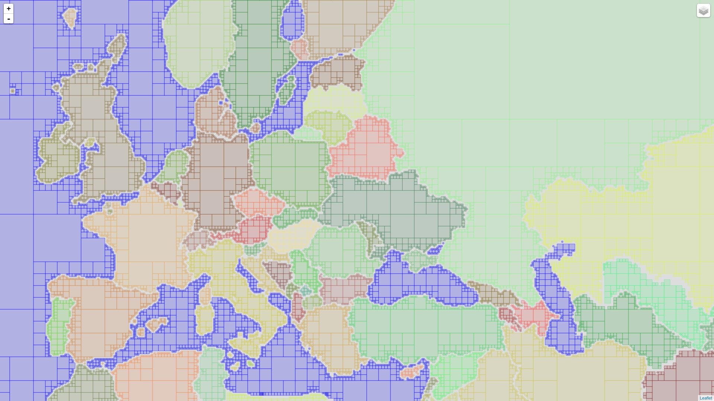

# OpenStreetMap tile usage global map kid analysis and visualisations

## Detect countries for each tile

    python3 fetch2.py | parallel --pipe --recend '' -k xz -9 > all-out.csv.xz

Now out file contains lines similar to next:

    2014-01-01,6,37,21,11270,54.2629207012382,30.9375,??|BY|RU|RU+UA|UA

1. `2014-01-01` - date when log collected;
2. `6` - tile zoom;
3. `27` - tile x;
4. `21` - tile y;
5. `11270` - count of tile fetches;
6. `54.2629207012382` - tile center latitude;
7. `30.9375` - tile center longitude;
8. `??|BY|RU|RU+UA|UA` - countries covered by tile `|` - split countries, `+` split two countries parts with same area in OSM, `??` - unknown counry sea, `BY` - ISO3166 alpha 2 code of country.

## Cache visualisation

To detect covered countris for all tiles I need some smart caching. Main idea that if one big tile coverd only one countr then all smaller tiles below this tile allso covered only this country.

Be careful, this pages can kill your browser. Hi FF, I love you, but you are slow.

- http://tbicr.github.io/map-trends/report_9.html
- http://tbicr.github.io/map-trends/report_10.html
- http://tbicr.github.io/map-trends/report_11.html

You can find that France for example not coverd. This because it covered in OSM with several polygins with FR and FX ISO3166-1. See counties list http://overpass-turbo.eu/s/a27.

Europe:

